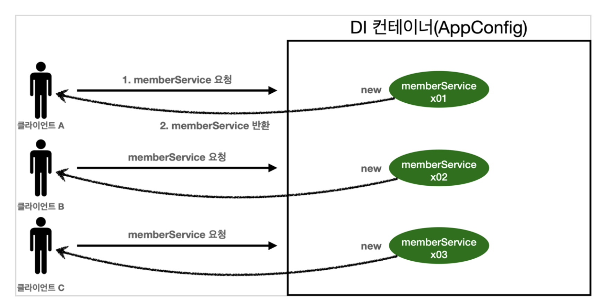
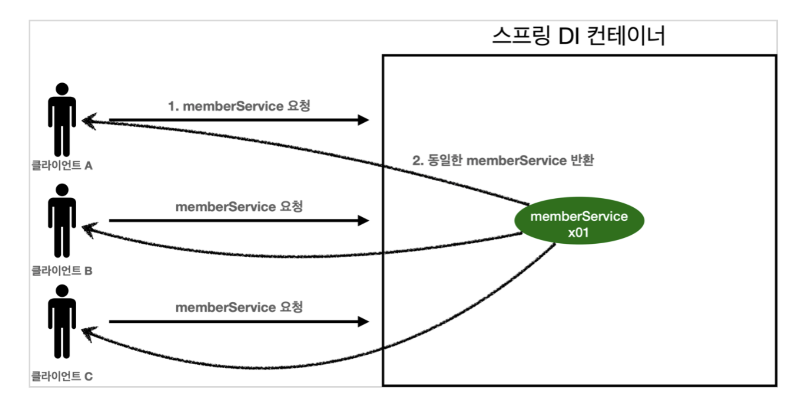

## 정적 팩터리 메서드를 사용하는 장점

- 생성자와는 달리, 이름을 가질 수 있다.

생성자의 이름은 클래스의 이름을 가질 수 밖에 없는 구조이기 때문에, 매개변수 만으로 어떤 역할을 하는지 한눈에 파악하기 어려울 수 있다.

하지만, 정적 팩터리 메서드는 네이밍을 직접 만들 수 있기 때문에, 생성자보다 더 명료하게 이해가 가능하다.

```jsx
class Car {
    private String brand;
    private String color;

    // private 생성자
    private Car(String brand, String color) {
    this.brand = brand;
    this.color = color;
}

// 정적 팩토리 메서드 (매개변수 하나는 from 네이밍)
public static Car brandBlackFrom(String brand) {
    return new Car(brand, "black");
}

// 정적 팩토리 메서드 (매개변수 여러개는 of 네이밍)
public static Car brandColorOf(String brand, String color) {
    return new Car(brand, color);
}
}
출처: https://inpa.tistory.com/entry/GOF-💠-정적-팩토리-메서드-생성자-대신-사용하자 [Inpa Dev 👨‍💻:티스토리]
```

- 호출될 때마다 인스턴스를 새로 생성하지 않아도 된다.

대표적으로, Singleton 패턴이 있는데, 싱글톤 패턴은 클래스의 인스턴스가 딱 한개만 생기도록 보장해준다. 



위 방법은 유저와 웹 어플리케이션이 통신할 때마다 객체를 매번 생성해주는 방식인데, 위 방법은 메모리 낭비가 심하다.



하지만, 싱글톤을 사용하게 되면, 클래스의 인스턴스가 딱 하나만 생기기 때문에 메모리를 훨씬 더 효율적으로 사용할 수 있다.

```agsl
class Singleton {
    // 1. static 영역에 인스턴스를 한개 생성
    private final static Singleton instance = new Singleton();
    // 2. private 생성자로 외부에서 호출되는 것을 막는다
    private Singleton() {}

    // 3. 외부에서 호출되는 것은 getInstance()
    public static Singleton getInstance() {
        return instance;
    }
}
```

- 반환 타입의 하위 타입 객체를 반환 할 수 있음

java 8버전 이후부터 인터페이스가 정적 메서드를 가질 수 있다.

- 입력 매개 변수에 따라서 매번 다른 클래스의 객체를 반환 가능

EnumSet 클래스는, public 생성자 없이 정적 팩토리만 제공하는데, 원소가 64개 이하면 RegularEnumSet의 인스턴스를,
65개 이상이면 JumboEnumSet의 언터페이스를 반환한다.

클라이언트 입장에서는 어떤 객체가 쓰였는지 알수도 없고, EnumSet의 하위 클래스이기만 하면 된다. (OCP 원칙이랑 엮어서 생각?)

- 정적 팩터리 메서드를 작성하는 시점에는 반환할 객체의 클래스가 존재하지 않아도 됨 

예를 들어, JDBC 프레임워크가 있다. 
* Connection - 서비스 인터페이스
* DriverManager.registerDriver - 제공자 등록 API
* DriverManager.getConnection - 서비스 접근 API 역할

## 단점 

- 생성자를 private이나 protected를 사용해서 외부에서 접근하는 것을 막아주기 때문에 상속이 불가능하다.

이러한 방식은, 상속보다 합성(Composition)을 사용하게 된다. 

상속 vs 합성 참고자료
* https://inpa.tistory.com/entry/OOP-%F0%9F%92%A0-%EA%B0%9D%EC%B2%B4-%EC%A7%80%ED%96%A5%EC%9D%98-%EC%83%81%EC%86%8D-%EB%AC%B8%EC%A0%9C%EC%A0%90%EA%B3%BC-%ED%95%A9%EC%84%B1Composition-%EC%9D%B4%ED%95%B4%ED%95%98%EA%B8%B0
* https://incheol-jung.gitbook.io/docs/q-and-a/architecture/undefined-2

- API 문서의 불편함 

API 문서에 명확히 정의되어 있지 않기 때문에 불편함이 있다. 네이밍 컨벤션을 사용함으로써 문제를 해결해야 한다.

* from - 매개 변수를 하나 받아서 해당 타입의 인스턴스를 반환하는 형변환 메서드
ex) Date d = Date.from(instant)

* of - 여러 매개변수를 받아적합한 타입의 인스턴스를 반환하는 메서드
ex Set<Rank> faceCards = EnumSet.of(Jack, Queen, King);

